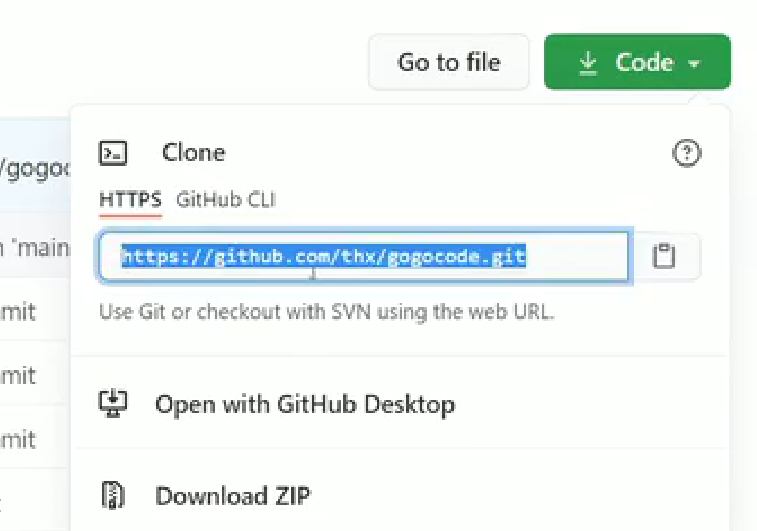
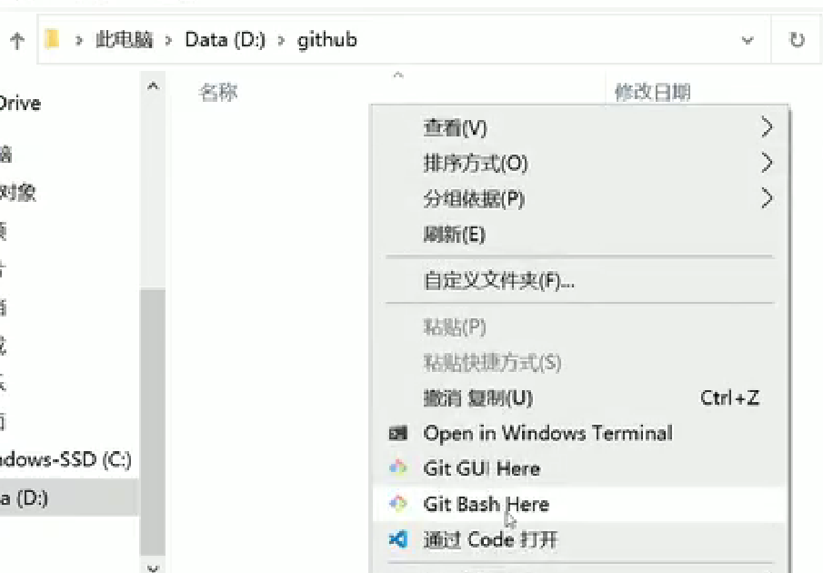
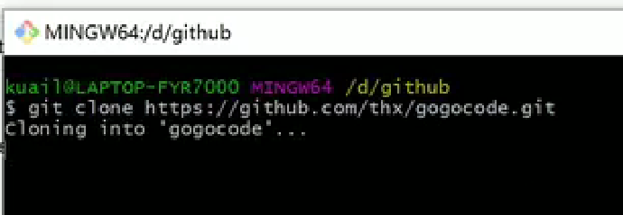
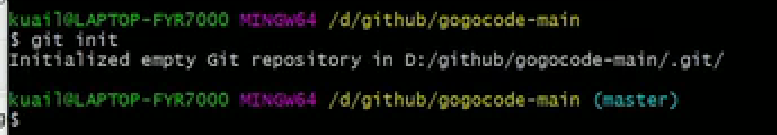
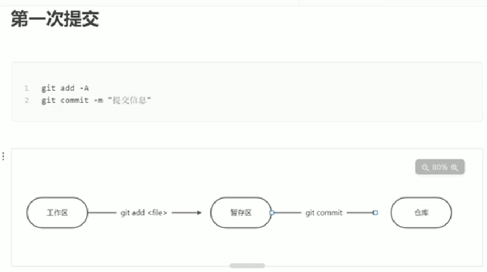
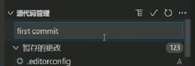
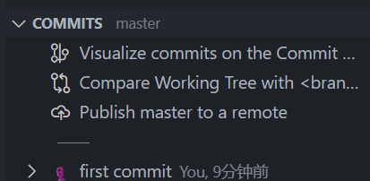

https://www.bilibili.com/video/BV1e541137Tc/?spm_id_from=333.999.0.0&vd_source=1727ab3eb30ee963ca494fb1ee22bb6c
####拉取项目到本地

Code->复制地址

进入想保存项目的文件夹->右键->git bash here

输入 git clone 地址
**********

commits可以查看提交历史记录
看看readme.md说明文档，issues讨论论坛，stars收藏数，lisence使用证书
###找开源项目的一些途径
? https://github.com/trending/
? https://github.com/521xueweihan/HelloGitHub
? https://github.com/ruanyf/weekly
? https://www.zhihu.com/column/mm-fe
? https://github.com/explore 
? https://changelog.com/weekly/archive

###特殊的查找资源小技巧-常用前缀后缀 
? 找百科大全 awesome xxx
? 找例子 xxx sample
? 找空项目架子 xxx starter / xxx boilerplate 
? 找教程  xxx tutorial
#完全版教程

####git init 初始化仓库（init完找不到--查看隐藏）

在.git所在文件夹右键--通过code打开
图形化操作--到暂存区--+号

输入提交信息--提交到仓库
####查看提交的历史记录：git log --stat
